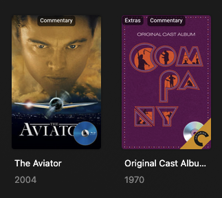

# bradflix kometa

Generates collections, overlays, manages quality profiles, and other metadata

## Overlays

* Criterion Collection ribbon
* Studio Ghibli ribbon
* Bonus Feature & Audio Commentary track labels
* TV Shows airing status
* Anime dub language tracks
* Physical Collection: DVD/Bluray disc overlay based on Letterboxd lists

## Quality Management
* Default quality profile is Bluray Remux. 
* Movies that go unwatched for more than a year get tagged `Stale` and downgraded to 1080p Archive quality.
